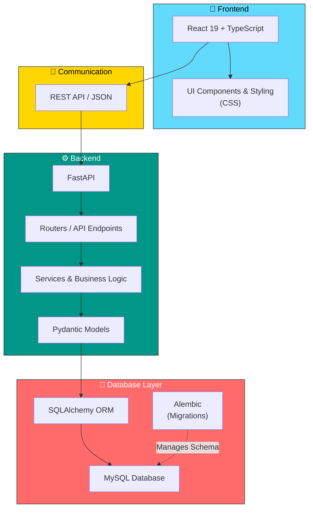

# Architecture Overview

This document outlines the high-level architecture of the ReactFastAPI project.

## System Architecture Diagram

## Technology Stack

### Frontend
- **Framework**: React 19 with TypeScript
- **Styling**: CSS
- **Communication**: REST API via JSON

### Backend
- **Framework**: FastAPI (Python)
- **Structure**:
  - **Routers**: API endpoint definitions
  - **Services**: Business logic and core operations
  - **Pydantic Models**: Data validation and serialization
  - **SQLAlchemy**: ORM for database interactions

### Database
- **Type**: MySQL
- **Migrations**: Alembic for schema versioning and management

## Language Composition

| Language | Percentage |
|----------|-----------|
| TypeScript | 55.1% |
| Python | 28.9% |
| CSS | 13.3% |
| Mako | 1.8% |
| HTML | 0.9% |

## Data Flow

1. **User Interaction** → React Frontend captures user actions
2. **API Request** → REST API call with JSON payload
3. **Backend Processing** → FastAPI receives request and routes to appropriate handler
4. **Business Logic** → Services process the request with Pydantic validation
5. **Database Operation** → SQLAlchemy ORM interacts with MySQL
6. **Response** → JSON response flows back to Frontend
7. **UI Update** → React re-renders with new data

## Database Migrations

Alembic is used for managing database schema changes and version control, ensuring smooth migrations across different environments.
