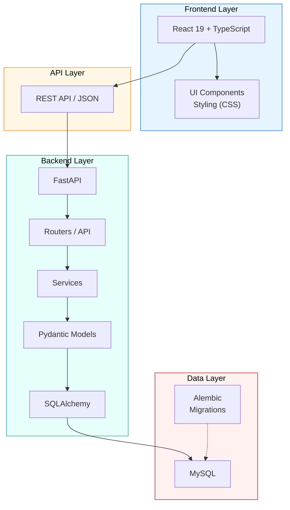

# ReactFastAPI

A project with React 19 (frontend) and Python (backend). Database - MySQL.

## Architecture Overview



## High-Level Structure

```text
React 19 + TypeScript
        │
        │ REST API / JSON
        ▼
FastAPI
 ├── Routers / API
 ├── Services
 ├── Pydantic Models
 └── SQLAlchemy
        │
        ▼
      MySQL
        ▲
        │
    Alembic
   (Migrations)
```

## Core Components

- Frontend: React 19 + TypeScript
- Backend: FastAPI (Python)
- API communication: REST API / JSON
- Data access: SQLAlchemy
- Database: MySQL
- Schema migrations: Alembic

## Language Composition

- TypeScript: 55.1%
- Python: 28.9%
- CSS: 13.3%
- Mako: 1.8%
- HTML: 0.9%
