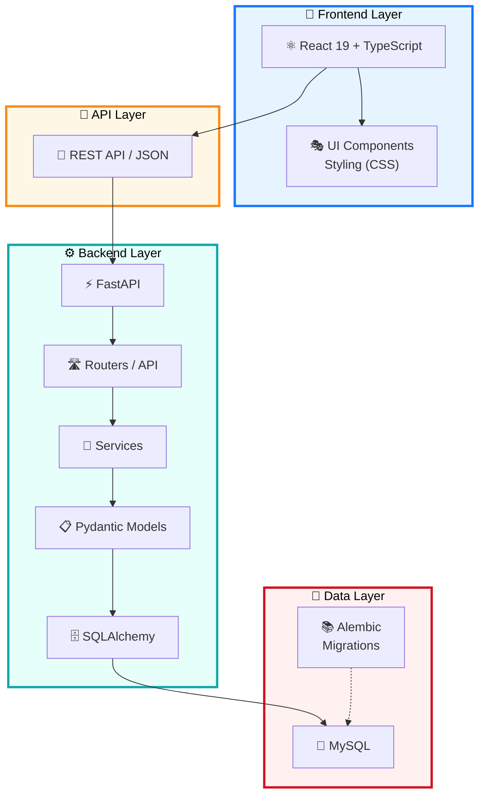

# 🚀 ReactFastAPI

A modern full-stack project with [React 19](https://react.dev) (frontend) and [Python](https://www.python.org) (backend). Database - [MySQL](https://www.mysql.com).

## 🏗️ Architecture Overview



## 📐 High-Level Structure

```
   ⚛️  React 19 + TypeScript
         │
         │ 📡 REST API / JSON
         ▼
   ⚡ FastAPI
    ├── 🛣️  Routers / API
    ├── 🔧 Services
    ├── 📋 Pydantic Models
    └── 🗄️  SQLAlchemy
         │
         ▼
       🐬 MySQL
         ▲
         │
       📚 Alembic
      (Migrations)
```

## 🔧 Core Components

| Component | Technology | Badge |
|-----------|-----------|-------|
| **Frontend** | [React 19](https://react.dev) + [TypeScript](https://www.typescriptlang.org) | ⚛️ |
| **Backend** | [FastAPI](https://fastapi.tiangolo.com) (Python) | ⚡ |
| **API Communication** | REST API / JSON | 📡 |
| **Data Access** | [SQLAlchemy](https://www.sqlalchemy.org) | 🗄️ |
| **Database** | [MySQL](https://www.mysql.com) | 🐬 |
| **Schema Migrations** | [Alembic](https://alembic.sqlalchemy.org) | 📚 |

## 📊 Language Composition

| Language | Percentage | Color |
|----------|-----------|-------|
| [TypeScript](https://www.typescriptlang.org) | 55.1% | 🔵 |
| [Python](https://www.python.org) | 28.9% | 🟡 |
| [CSS](https://developer.mozilla.org/en-US/docs/Web/CSS) | 13.3% | 🟣 |
| [Mako](https://www.makotemplates.org) | 1.8% | ⚪ |
| [HTML](https://developer.mozilla.org/en-US/docs/Web/HTML) | 0.9% | 🟠 |

## 🎯 Tech Stack Summary

- **Frontend Framework**: [React 19](https://react.dev) with [TypeScript](https://www.typescriptlang.org)
- **Backend Framework**: [FastAPI](https://fastapi.tiangolo.com)
- **Database ORM**: [SQLAlchemy](https://www.sqlalchemy.org)
- **Database**: [MySQL](https://www.mysql.com)
- **Database Migrations**: [Alembic](https://alembic.sqlalchemy.org)
- **API Protocol**: REST / JSON

---

✨ **Built with modern technologies for scalability and performance**
